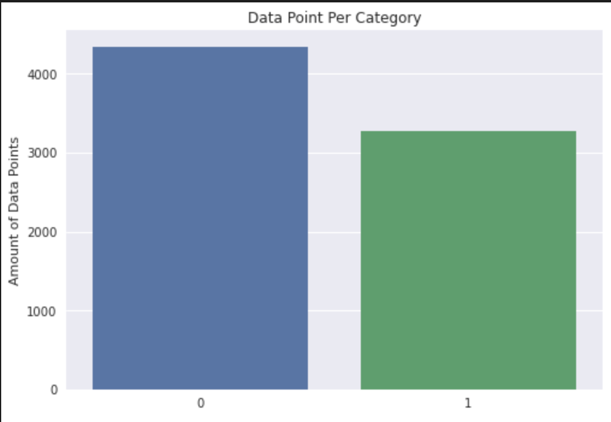
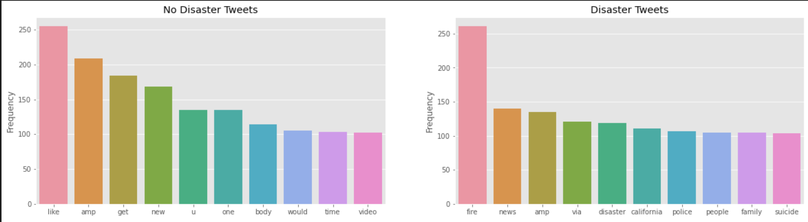

# Classifying Disaster Tweets

This analysis is looking to build a model that can correctly classify tweets that talk about a disaster.

## Question
-	Can we build a model that can classify tweets related to a disaster?

## Data Description
-	The dataset contains over 7.5K tweets that pertain to any disaster and tweets that sound like they pertain to a disaster, but in reality, are not.
-	The dataset contains columns such as tweet ID, tweet keyword, location, text, and target variable.

## Data Cleaning
-	Dropped all columns except text and target value.
-	Removed stop words, links, and punctuation. 
-	Lemmatize all the words.

## Data Exploration
The dataset contains a wide variety of tweets. For example, there are tweets that specifically speak about a disaster. However, there are tweets that use hyperboles to describe a situation. There are tweets that are specifically not about a disaster too. Both groups are relatively balanced, but more data can be gathered in order to be closer to perfectly balanced.

When looking at a distribution of words in each category, the words seem to match their category. For example, disaster tweets tend to talk about fire, news, police, suicide, and people among other things. While non disaster tweets have words that can be unrelated to disasters.

## Modelling Disaster Tweets
This study is looking to provide a binary model to classify tweets into their correct categories. In order to achieve this, a comparison was made with the following algorithms, and the best one was chosen.
- Logistic Regression
- Decision Tree
- Random Forest
- AdaBoost
- Gradient Boost
- XGBoost Classifier
- SVC
- Naive Bayes  
  
The best performing algorithm was Naïve Bayes. It achieved a 74% F1 Score and 80% accuracy score.

## Conclusion
With only 7,000 points of data, it can be hard to diversify samples. However, this model has achieved a great score. Over time, it is likely that this score will improve due to the model getting more diverse data. In order to get the model to that point, it would be advisable to gather more data and to hyper tune the top 3 algorithms. However, this would be a great tool in order to identify disasters quickly. This would help disaster affected areas get help faster, and communicate the news faster in case of hazards that would require people to avoid the area. 
